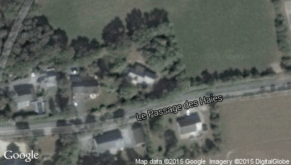

# Maps

This project contains:

* an abstraction of web maps services,
* some implementations such as _Google Maps_ and _Open Street Maps_ and _TomTom_,
* a demo.

## Requirements

It requires a Java platform with _NET-EMBEDDED-1.0_ and _MICROUI-2.0_.

It also gets some dependencies from MicroEJ public artifacts repository (see http://developer.microej.com/ivy/).

The project needs the _org.json.me_ library (can be found here: https://github.com/MicroEJ/org.json.me).

## Example

Searching this address: _Le pas des haies, Grandchamps des Fontaines_, it displays this map:

